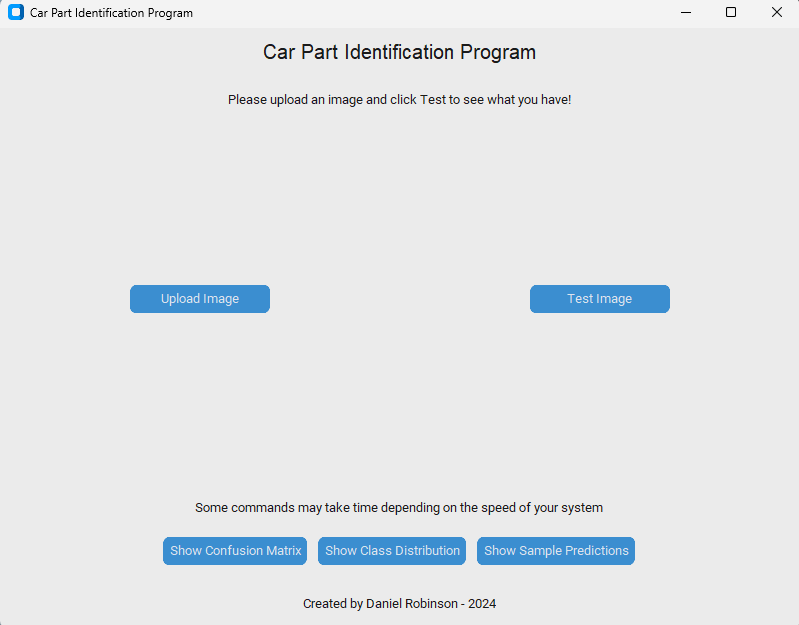

# Car Parts ID

## What is this? 
This a project I did as part of my bachelors degree
based on an issue I faced when I was operations manager
at a car dealership. As part of my coursework, we needed
to make a machine learning application, and when I was at the
car dealership, it was notoriously difficult to find employees 
who could identify different car parts, and thus this application 
was born! 

## How does it work?
The program uses a public dataset from Kaggle with images of 
different car parts. That dataset can be found 
[here](https://www.kaggle.com/datasets/gpiosenka/car-parts-40-classes).

The dataset includes an optimized "EfficientNetB2" model pretrained
on the dataset, but my code can train its own model so that users
can add to the dataset and expand functionality. 

### Using my code to train a model:
A model can be trained by downloading the dataset from Kaggle, and 
copying the directories labeled "train, test, and valid" into the "dataset"
directory in the root of the code. 

With the train, test, and valid directories in place, running
"train_model.py" will yield a dataset file called "car_parts_model.h5"
in the root directory.

## Running the program with a trained model:
The application has a GUI created using customtkinter. To start it,
run gui.py

Once the GUI is running, users can upload an image and then click test
to identify the car part. There's also options to show different visual 
representations of the data for use with testing

